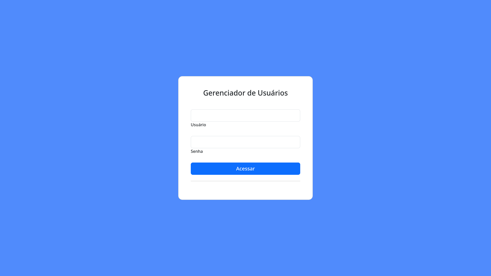

# KAYROS-TECH-MVC

## O que é o CodeIgniter?

O CodeIgniter é um framework PHP full-stack que é leve, rápido, flexível e seguro.  
Mais informações podem ser encontradas no [site oficial](https://codeigniter.com).

Este repositório contém um iniciador de aplicativo que pode ser instalado com o **composer**.  
Ele foi criado a partir do [repositório de desenvolvimento](https://github.com/codeigniter4/CodeIgniter4).

Mais informações sobre os planos para a versão 4 podem ser encontradas em [CodeIgniter 4](https://forum.codeigniter.com/forumdisplay.php?fid=28) nos fóruns.

Você pode ler o [manual do usuário](https://codeigniter.com/user_guide/) correspondente à versão mais recente do framework.

## Instalação e Atualizações

Execute `composer create-project codeigniter4/appstarter` e depois `composer update` sempre que houver uma nova versão do framework.

Ao atualizar, verifique as notas de lançamento para ver se há mudanças que você precisa aplicar na pasta `app`. Os arquivos afetados podem ser copiados ou mesclados de `vendor/codeigniter4/framework/app`.

## Configuração

Crie o arquivo `.env` e personalize conforme sua aplicação, especialmente a baseURL e as configurações do banco de dados.
```bash
    CI_ENVIRONMENT = development
    database.default.hostname = localhost
    database.default.database = nome_do_banco
    database.default.username = usuario
    database.default.password = senha
``` 


Exemplo de configuração para CodeIgniter 4 (em app/config/Database.php):
```php
    public $default = [
    'hostname' => 'localhost',
    'username' => 'seu_usuario', // Substitua pelo nome do novo usuário
    'password' => 'sua_senha', // Substitua pela senha do novo usuário
    'database' => 'nome_do_banco', // Substitua pelo nome do banco de dados
    'DBDriver' => 'MySQLi',
    'DBPrefix' => '',
    'pConnect' => false,
    'DBDebug' => (ENVIRONMENT !== 'production'),
    'cacheOn' => false,
    'encrypt' => false,
    'compress' => false,
    'stricton' => false,
    'failover' => [],
    'save_queries' => true
];
```

Certifique-se que o baseURL de sua aplicação esteja correto, caso contrário haverá problema de redirecionamento no momento que iniciar a aplicação.

```php
    app/config/app.php
    public string $baseURL = 'http://localhost:8080/';

```

### Iniciando a aplicação
Execute o comando `php spark serve`, esse comando realizará uma abertura de porta individual em seu localhost e possibilitará visualizar o projeto.

Crie o banco de dados e as tabelas necessárias para a execução da aplicação.
Siga o documento presente no diretório `sql/templateDatabase.sql` do projeto.

**Importante ressaltar que será se extrema importânica criar um usuário `master` para que consiga instanciar o uso da aplicação. Siga o exemplo abaixo:**
```sql
    INSERT INTO users (username, password, is_master) VALUES ('user_master', 'password', 1);
```

## Previews
### Login




#### Crud


## Mudança Importante no index.php

O arquivo `index.php` não está mais na raiz do projeto! Ele foi movido para a pasta *public*, para maior segurança e separação dos componentes.

Isso significa que você deve configurar seu servidor web para "apontar" para a pasta *public* do seu projeto, e **não** para a raiz do projeto. Uma prática melhor seria configurar um host virtual para apontar para lá. Uma prática ruim seria apontar seu servidor web para a raiz do projeto e esperar acessar via *public/...*, pois o restante da lógica e o framework estarão expostos.

**Por favor**, leia o manual do usuário para uma explicação melhor de como o CI4 funciona!

## Gerenciamento de Repositório

Usamos os **issues** do GitHub no nosso repositório principal para acompanhar **ERROS** e os pacotes de trabalho **DEVELOPMENT** aprovados.  
Usamos o nosso [fórum](http://forum.codeigniter.com) para fornecer **SUPORTE** e discutir **REQUISIÇÕES DE FUNCIONALIDADES**.

Este repositório é um repositório "de distribuição", criado pelo nosso script de preparação de lançamentos.  
Problemas com ele podem ser reportados no nosso fórum ou como **issues** no repositório principal.

## Requisitos do Servidor

É necessário PHP na versão 8.1 ou superior, com as seguintes extensões instaladas:

- [intl](http://php.net/manual/en/intl.requirements.php)
- [mbstring](http://php.net/manual/en/mbstring.installation.php)

> [!AVISO]
> - A data de fim de vida do PHP 7.4 foi em 28 de novembro de 2022.
> - A data de fim de vida do PHP 8.0 foi em 26 de novembro de 2023.
> - Se você ainda estiver usando o PHP 7.4 ou 8.0, deve atualizar imediatamente.
> - A data de fim de vida do PHP 8.1 será em 31 de dezembro de 2025.

Além disso, verifique se as seguintes extensões estão habilitadas no seu PHP:

- json (habilitado por padrão - não desative)
- [mysqlnd](http://php.net/manual/en/mysqlnd.install.php) caso você planeje usar MySQL
- [libcurl](http://php.net/manual/en/curl.requirements.php) caso planeje usar a biblioteca HTTP\CURLRequest
